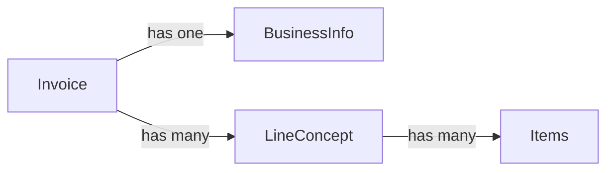

# Ruby Design Patterns

This repo shows some examples of design patterns in ruby language. This is only for learning purposes and may contain failures or code that is not the best. This is intentionally to simplify the comprehension of the patterns.

## Introduction

I have been thinking about a global scenario in where I could show most part of examples. I have decided to apply examples to business envoironment. But it is easy, we only are going to have invoices with business data and line_concepts. this diagram will show you about it:

## Contributions

Feel free to add improvements or suggesting changes to the repo making requests.

## Author

Juan Manuel Jurado (jmjurado23)

## Thanks to

I highly recommend read this book to understand design patterns in ruby:

* **Dessing patterns in Ruby (Russ Olsen)**