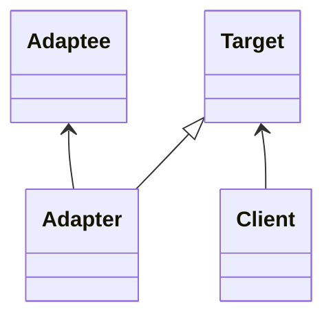
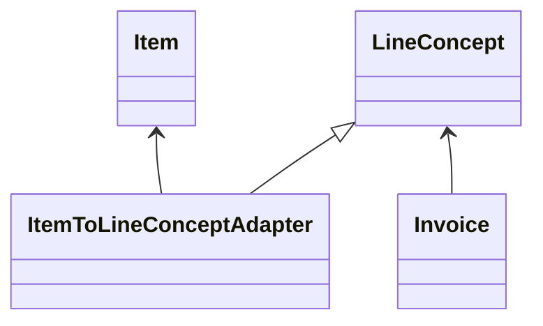

# Adapter Pattern

This pattern lets us create an adapter for a specific item to define the behavior of another element that is the target.



In this example, we have the client that is the invoice that requires line concepts like target. Line concepts need a method resume to work within the invoice. Like an item is not a line concept, we need an adapter that is initialized with the item (adaptee) offering the method resume of the target.

In the example can be watched like the invoice we may add adapters in addition to line concepts.




## Try it

In your console execute:
```bash
ruby addapter-pattern/working-example/example.rb
```