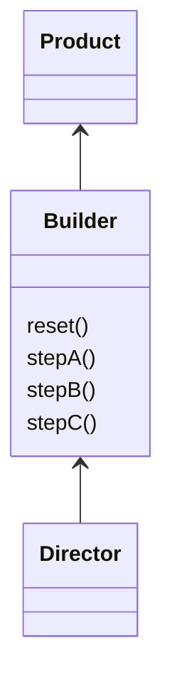
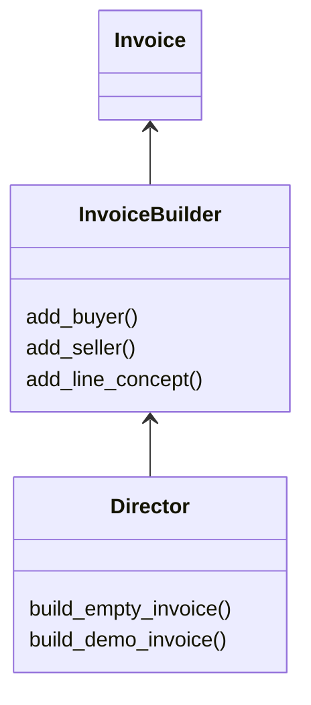

# Builder Pattern

This pattern lets us have a tool to construct an object in a free way. You could add properties to the object through the builder.



In this example we use an invoice builder to create an invoice. This builder simplify the task of creating subelements and adding it to the invoice.



## Try it

In your console execute:
```bash
ruby builder-pattern/working-example/example.rb
```