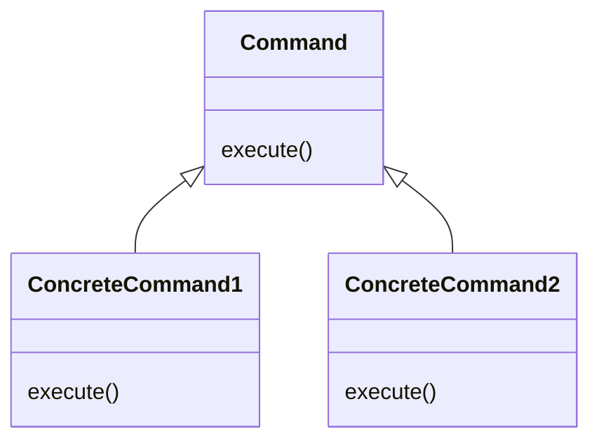
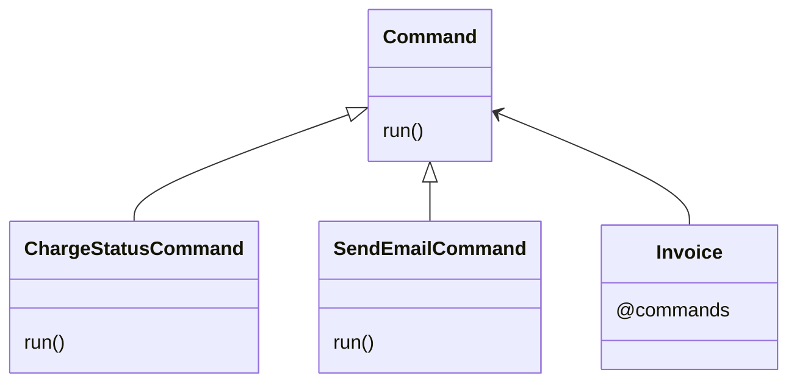

# Command Pattern

This pattern lets us separate action logic from elements. We could group commands and execute them associating them to an item class.



In this example, we have commands that define logic for invoices. This logic can be associated with invoice class and executed when an event is launched. Another way of using commands is to create separate logic and parse the item class directly to the command as a parameter and execute the command.

A command should have only a method to execute or run.




## Try it

In your console execute:
```bash
ruby command-pattern/working-example/example.rb
```