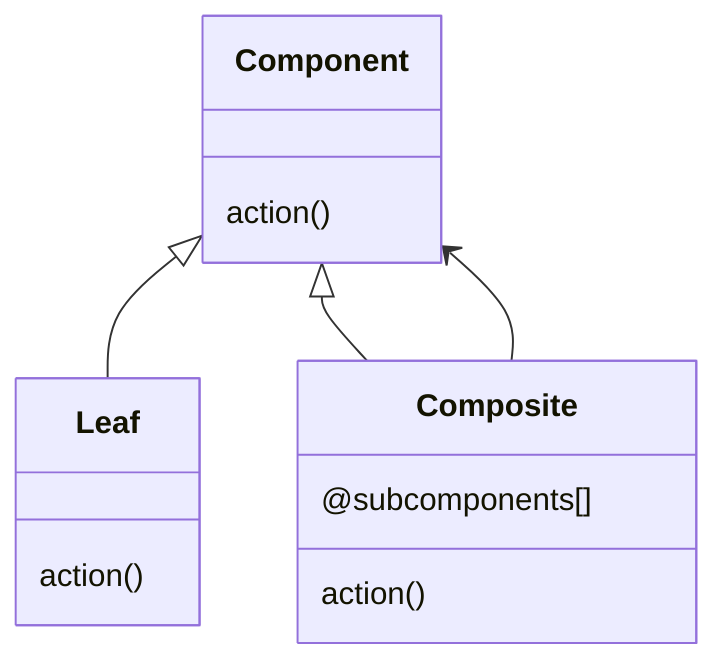
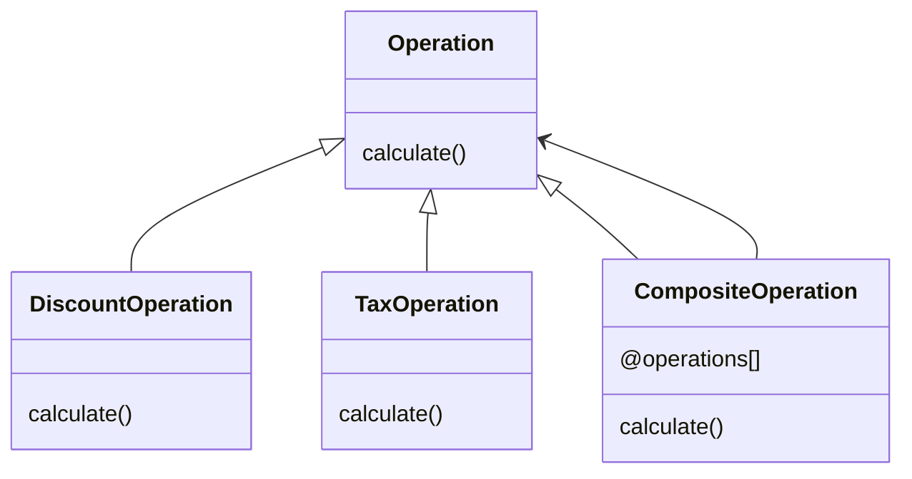

# Composite Pattern

This pattern lets us group actions or tasks to do it in one time. It is good when you want to define a serie of tasks to do specific work over the data.



In this example, we have actions for add a tax or to add a discount. This tasks can be added to the composite to define specific composites for each situation in our platform



## Try it

In your console execute:
```bash
ruby composite-pattern/working-example/example.rb
```