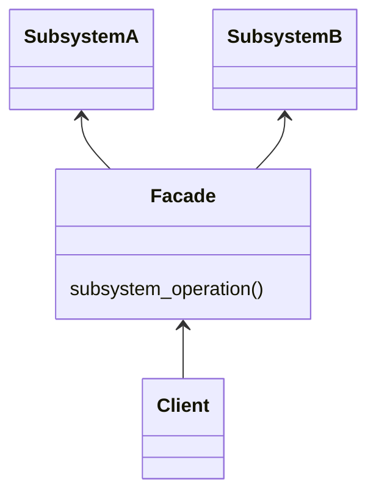
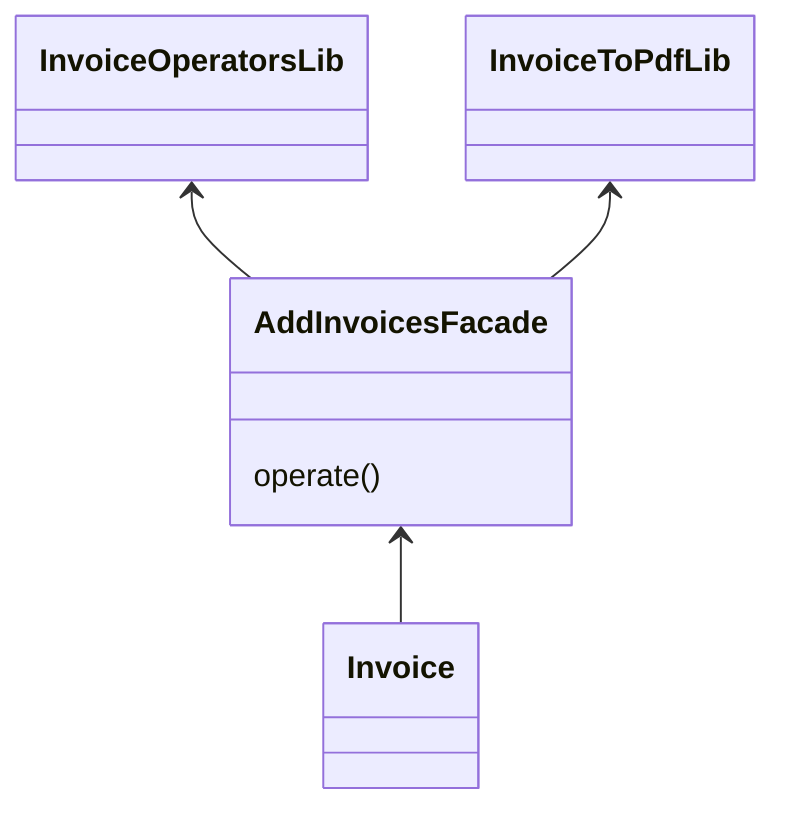

# Facade Pattern


This pattern lets us simplify the interaction with multiple resources like libs or tools using an element (facade) to encapsulate the access.



In this example, we have a facade for adding two invoices, in this process two libs are implied and this facade is the class that has the dependencies with the libraries. The main program will use the facade method to operate instead of access to the libs and perform the operation.



## Try it

In your console execute:
```bash
ruby facade-pattern/working-example/example.rb
```