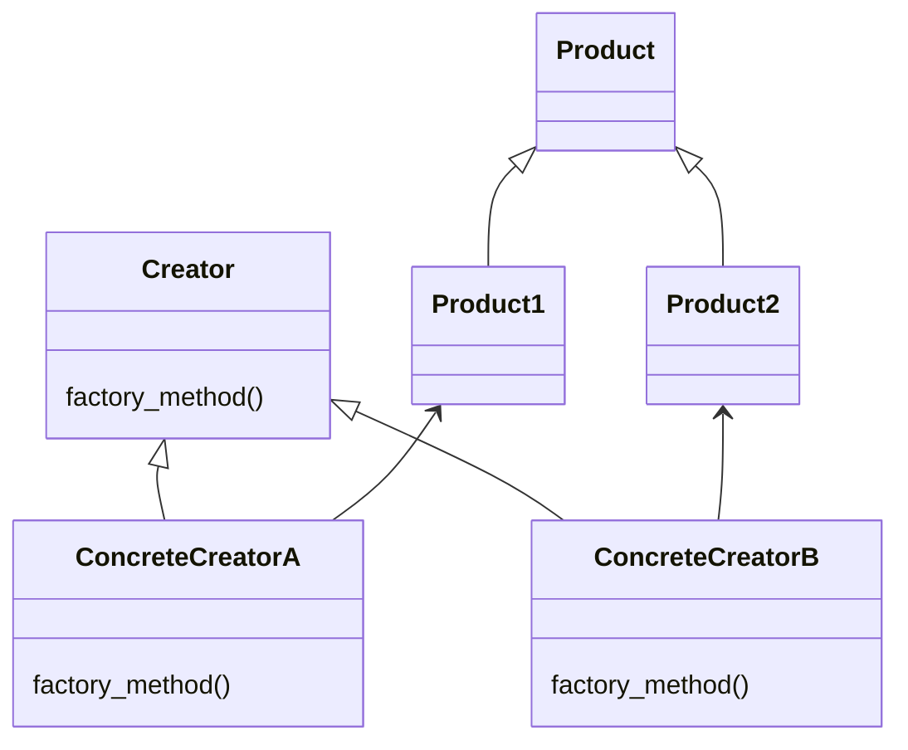
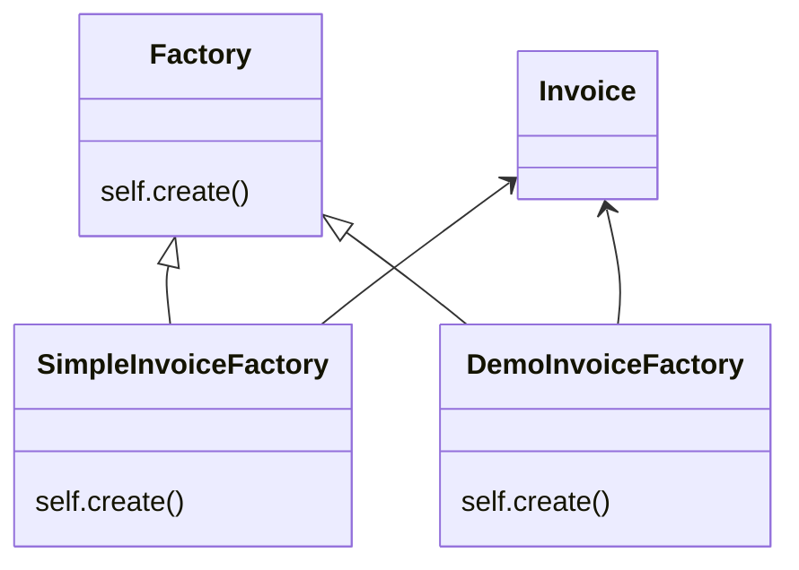

# Factory Pattern

This pattern lets us create elements of a type, helping us from a tool. This tool is called factory and can create different versiones of the original one.



In this example, we have two factories: simple and demo. Each one build differents versions of invoices. Both have to extend from factory abstract class.

There are many ways of use factories.




## Try it

In your console execute:
```bash
ruby factory-pattern/working-example/example.rb
```