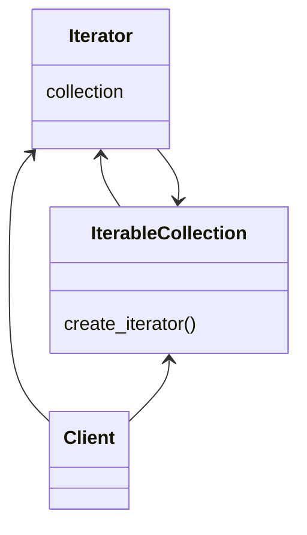
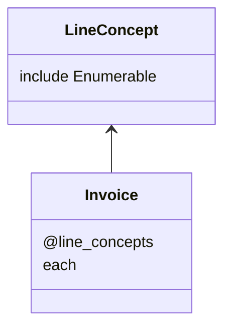

# Iterator Pattern

This pattern lets us iterate over elements. We can define a element that manage the iterators. This element should implement methods to add, compare or make operations over the elemenents.



In this example we use invoice like an iterator of line concepts. Ruby have the module Enumerable that give by default a big amount of methods for iterables.



## Try it

In your console execute:
```bash
ruby iterator-pattern/working-example/example.rb
```