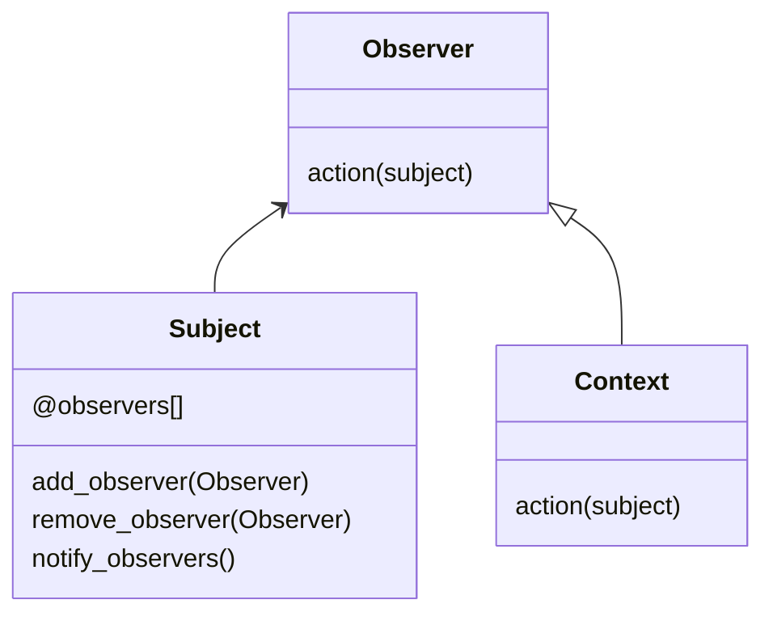
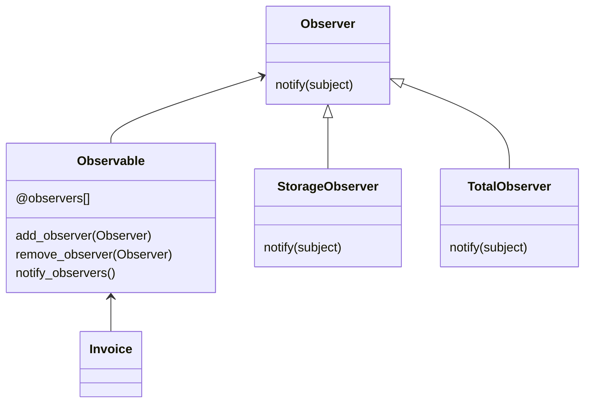

# Observer Pattern

This pattern lets us listen changes in elements of a class. The objetive of this pattern is that you could add the observers that you need and can disable any of them. Easily you could be notified about changes on a class.



In this example, we need to know when a invoice line concept is added to notify storage or total counter about the change in the invoice. We will add the needed observers to obtain the notifications.




## Try it

In your console execute:
```bash
ruby observer-pattern/working-example/example.rb
```