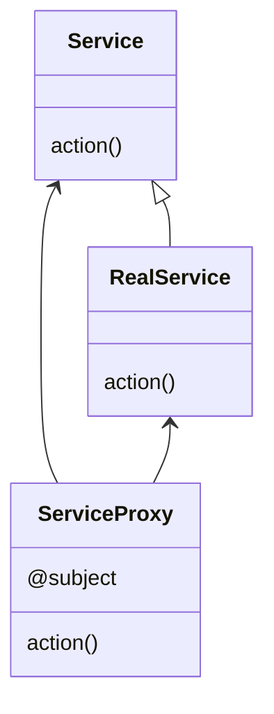
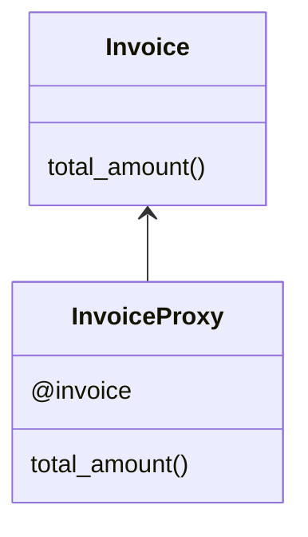

# Proxy Pattern

This pattern lets us add logic before accessing the real element. It may be utilized to add permissions or add transformations before accessing the real object. We have to initialize the proxy with the real class.



In this example, we have the real class invoice and his proxy that add functionality before access to it.



## Try it

In your console execute:
```bash
ruby proxy-pattern/working-example/example.rb
```