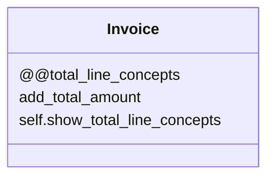

# Singleton Pattern

This pattern lets us use an object uniquely in the platform. It should be valid for configurations. In Ruby we could apply to a class behavior of singleton defining some variable like class vars.

In this example, we have Invoice that have the property total_line_concept shared between any instance of invoice.



## Try it

In your console execute:
```bash
ruby singleton-pattern/working-example/example.rb
```