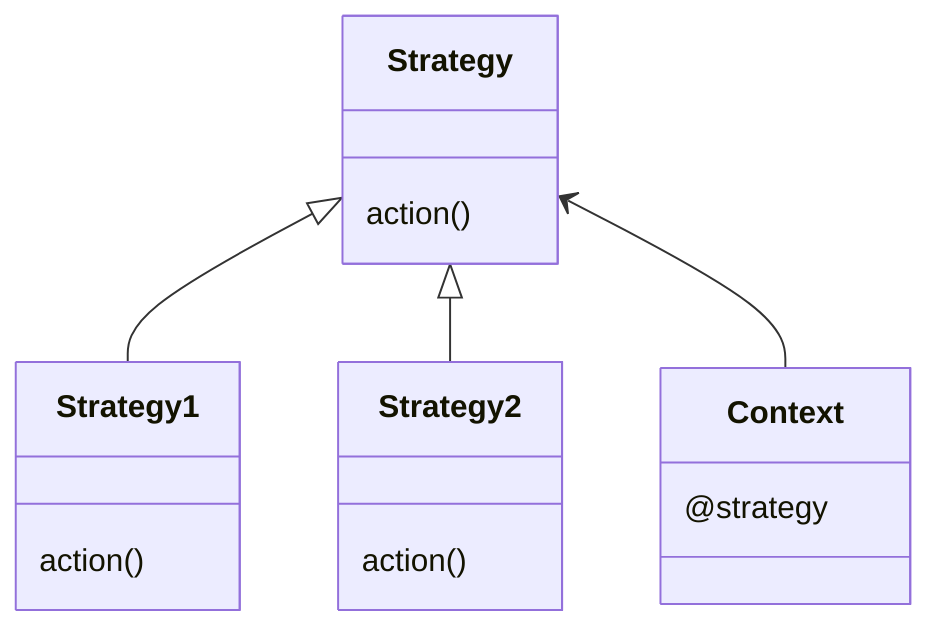
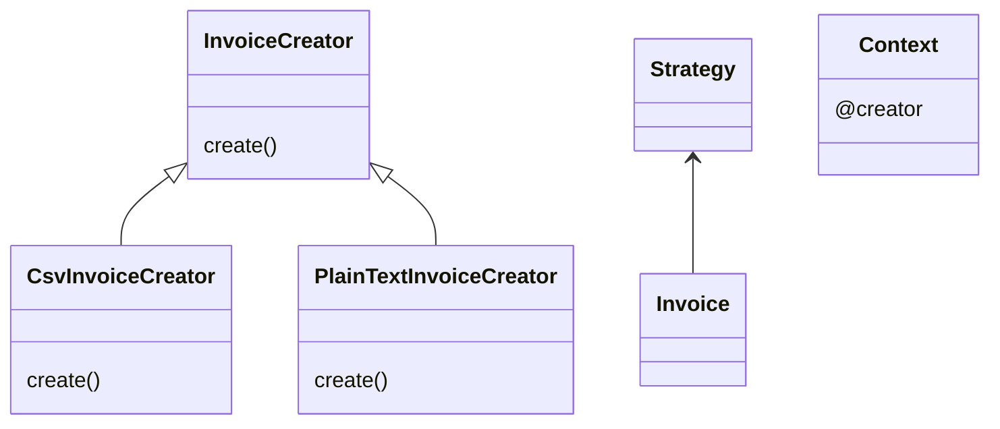

# Strategy Pattern

This pattern lets us populate a class with a strategy to do one specific process. The same class could work in different ways when you use a different strategy.



In this example, we need to create an invoice. The process of populating an invoice is always the same, but the process of creating in different formats is not the same. In this case, we need a csv invoice and a plain text invoice that uses the template method pattern to create different types of invoices. For this purpose, we have to create different strategies and initialize invoice classes with one of them.




## Try it

In your console execute:
```bash
ruby strategy-pattern/working-example/example.rb
```