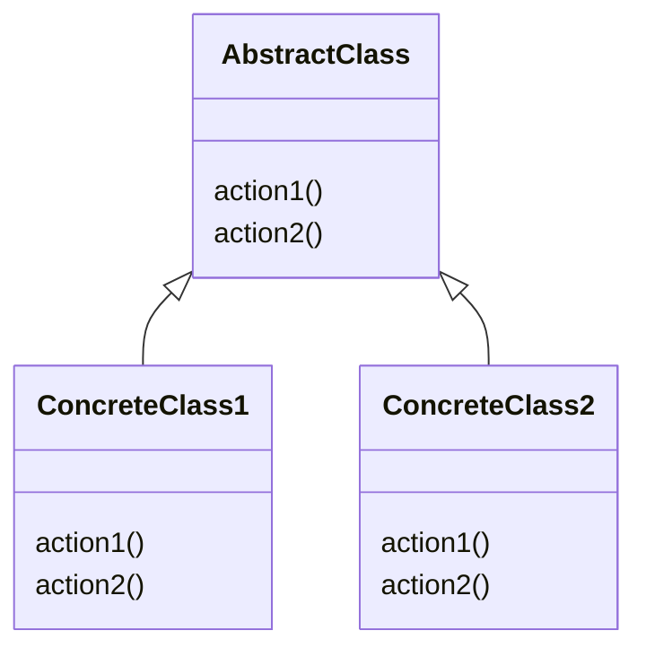
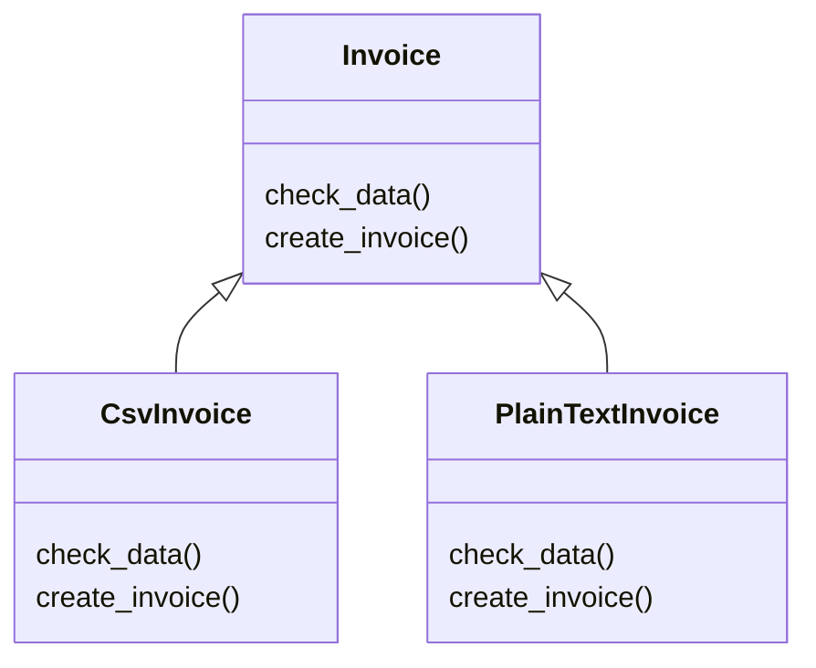

# Template Method Pattern

This pattern let us use a class and adapt it in subclass of the same overwriting some methods. The template is like a guide to help us to use the main class.



In this example, we need to create an invoice. The process of populate an invoice is always the same, but the process of create in different formats is not the same. In this case, we need a csv invoice and a plain text invoice that use the template method pattern to create different types of invoices overwriting the generate method.




## Try it

In your console execute:
```bash
ruby template-method-pattern/working-example/example.rb
```